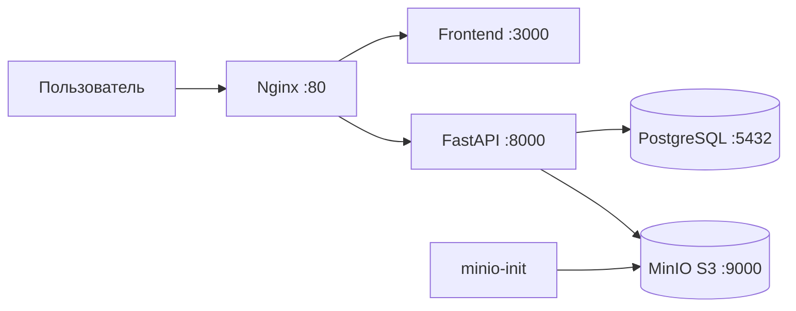

# Лабораторная работа №6

## Тема

Контейнеризация и автоматизация развертывания веб-приложения **Contract Workspace**.

## Что контейнеризовано

Проект разделен на сервисы:

- `frontend` - Next.js/React клиентская часть.
- `api` - FastAPI backend.
- `postgres` - основная БД приложения.
- `minio` - S3-compatible объектное хранилище для файлов.
- `minio-init` - одноразовый сервис, который ждет MinIO и создает bucket.
- `nginx` - reverse proxy для единой точки входа.

## Сетевая схема



Все сервисы подключены к внутренней docker-сети `app_net`. Наружу пробрасываются только:

- `80` - приложение через Nginx;
- `9000` - S3 API MinIO для локальной проверки;
- `9001` - консоль MinIO.

## Запуск локально

```bash
cp .env.example .env
docker compose up --build
```

После запуска:

- приложение: `http://localhost`;
- API healthcheck: `http://localhost/api/v1/health`;
- MinIO console: `http://localhost:9001`.

## Проверка перед сдачей

```bash
# backend
cd services/api
python -m pip install -r requirements.txt
python -m pytest -q

# frontend
cd ../../apps/frontend
npm ci
npm run test:smoke
npm run lint
npm run typecheck
npm run build

# docker compose
cd ../..
docker compose config --quiet
docker compose up -d --build
python scripts/compose_smoke.py
docker compose down -v --remove-orphans
```

## CI/CD в GitHub Actions

В папке `.github/workflows` настроены три проверки:

1. `api.yml` - устанавливает Python-зависимости, запускает `pytest`, затем проверяет сборку Docker-образа backend.
2. `frontend.yml` - выполняет `npm ci`, smoke-тесты, lint, typecheck, production build и Docker-сборку frontend.
3. `compose.yml` - валидирует `docker-compose.yml`, собирает все сервисы, поднимает приложение и запускает smoke-сценарий через `scripts/compose_smoke.py`.

## Безопасная конфигурация

Секреты не хранятся напрямую в коде. Для локального запуска используется `.env.example`, который нужно скопировать в `.env`. Настоящие production-значения должны задаваться через переменные окружения или GitHub Secrets.

В `.gitignore` исключены `.env`, локальная БД, загрузки, `node_modules`, `.next`, виртуальное окружение Python и временные кэши.

## Почему была ошибка в GitHub

В старых workflow-файлах остались строки конфликта Git:

```text
[git conflict marker: opening]
[git conflict marker: separator]
[git conflict marker: closing]
```

Из-за них GitHub Actions отклонял проверки еще на этапе чтения YAML. В исправленной версии conflict markers удалены, `runs-on` заполнен, а jobs разделены на backend, frontend и Docker Compose smoke test.
